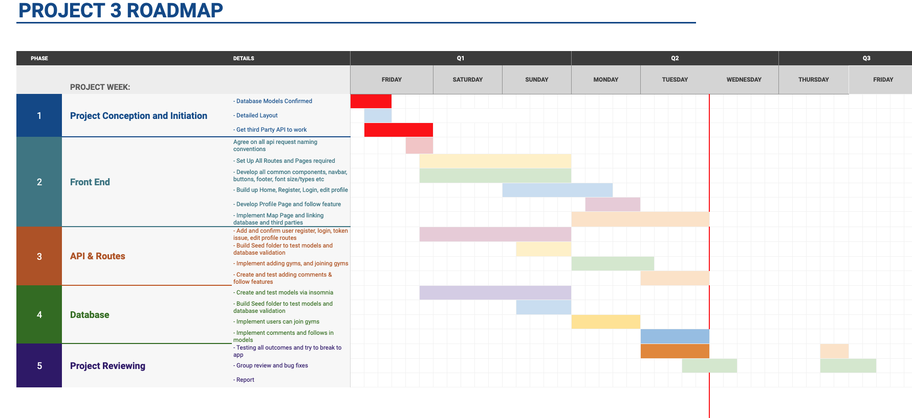
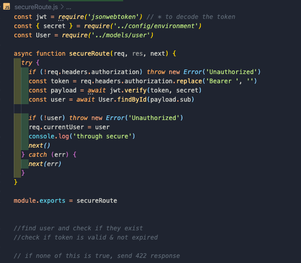
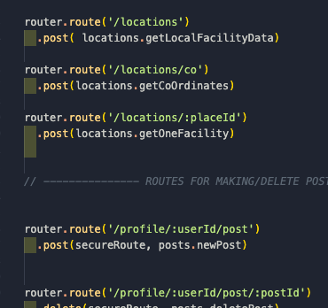
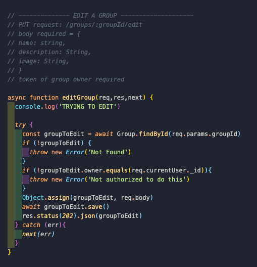

(Insert logo)

# Spot.Me - Fitness Social Media Platform

## **1.0 - Brief**
***Timescale: 1 week, Team Size: 4***

The brief for this project focused mainly on what the core technologies would be required which was to build a full stack application using React app supplemented with a client-side Express framework and MongoDB database. 

This was our first group project where we were required to create a strategy and delegate tasks efficiently to replicate a real world project scenario. 

***Note: My role in this project was to work on the server side creating a RESTful API with Node, Express and Mongoose. Most of the detail in this readMe will be focused on the server side***

## **2.0 - Overview**

Team project utilising the MERN stack and third-party APIs to build a platform for users to find local fitness facilities, create groups and post events between followers. 

My role in the project was to work on the back-end creating a wide array of controllers, models and RESTful APIs which enabled the team to consume the required data they needed on the front-end.

Our site required API data from Mapbox (producing maps) and Google Places (for facilities data and reviews) which was good exposure into some of the most popular APIs to date. 

The project was great coordination practice for me, as I needed to ensure all the API calls were clear with what information was required such as request content and valid authentication tokens.

## **3.0 Technology Summary**

### **3.1 - Client Side**

- Reactjs (Hooks and Class based)
- Bulma Framework
- Mapbox API
- Google Places API

### **3.2 - Server Side**

- Node.js
- ExpressJS
- MongoDB
- Mongoose
- JWT Authentication
- Heroku

## **4.0 Planning**

I made a gantt chart at the beginning of the project which was to spread out all the tasks over the week and from this we could determine who will take on what responsibilities and also keep track of our current progress.

In order to keep momentum going, we decided that we were able to begin the front-end and back-end at the same time and specifically decided to hold off on certain areas. In order to reduce the risk of bottlenecking and delays, components that required axios requests to the back-end were less of a priority as Myself and a colleague needed to finish our backend parts first and communicate what the required information the controllers needed. 

### **4.1 - Git and VSCode Livesharing**

We would utilize live-sharing a few times per day to allow everyone to review and assist in all areas of the projects where needed. Generally we would make a routine of git pulling, merging and committing our branches to the master and then alerting the rest of the team so they can pull.

 This was an important experience for us to always be cautious of other team members' work and avoid writing over code. This rarely ever happened as we distributed tasks within the team in a way that reduced the need to work on the same files at any given time.

## **5.0 RESTful API**

### **5.1 - Routes**

My colleague worked on creating the secureRoutes in the project and I worked alongside him to make sure all the routes that required valid tokens were coordinated correctly. 

Once the route was determined by the Express App, the http request would be evaluated if needed to check if the token was real and had not expired. 

If the request had a valid token within the authentication header, then the controller would be invoked and do any further checks on the tokens if needed.

### **5.2 - Controllers**

The controllers I built for the project followed a fairly similar CRUD pattern except they were targeting a different model in the app (groups / comments / follows etc.)

All of the controllers were discussed with the team but for clarity, I have commented above each controller the requirements including: url path, type of request, required body/headers or if a valid token was required.

Valid tokens were determined when the request comes to the server and so some controllers would not even be invoked if the attached header token did not exist. Even if the token is valid, the controllers would check to see if the valid token was the same as the owner of the model to be updated.

## **6.0 Database**

### **6.1 - MongoDB**

The criteria for this project was to use a noSQL database which was good exposure to this new type of data storage - particularly as it follows fairly similar structure to JS objects and at the time, our team was more comfortable with this syntax.

The nature of social media sites which generally involve many comments and likes that are nested within others means that arguably an SQL database would be far more suitable than mongoDB as there can be multiple join tables with ManyToMany relationships.

Nesting too deep within Mongo would have led to poor efficiency and also confusing syntax when it would be necessary to populate all of the comments. Due to this, we limited the amount of nesting of comments so only one level of nesting could be done by users (commenting on a post but nobody can comment on the comment).

The toughest area to work on was the news feed as it was required to gather and send over a random selection of posts from various different models (group posts, user posts) and all their associated netted comments. - Populating issues were found with this.

### **6.2 - Mongoose**

Mongoose was used to interface with our mongo Database as myself and the team felt more comfortable with the schema like system that it offered. The user models are quite fleshed out and have a lot of detail which connects to all the other models in some form or another.

## **7.0 Personal Reflection**

### **7.1 - Wins**

- I am pleased with what I have learnt about group coordination and how crucial it is to always be aware of what each other are doing. There were some occasions early on in the project where code was overwritten by each due to weak communication or confusion over responsibilities. These were swiftly resolved though.
- It was great hands on practice with using GitHub and pulling, merging and pushing. We came up with a system of notifying each other when pushing to development and everyone pulling at the same time which I believe avoided a lot of issues.
- It was very rewarding and interesting to work on the server side and getting stuck in with Express. I really enjoyed creating a variety of controllers and imagining how the data was going to be queried in the database, altered where needed and then sent off to do it's work on the front-end.
- Finally I was not disappointed with how fun the back-end is! I always was interested in how servers work and actually doing was just as I had hoped!

### **7.2 - Challenges**

- I feel like the biggest challenge was assisting the front-end when needed because the React App had a lot of third party packages which I had never come across before.
- Naturally, everybody has their own style of working and it takes time to get familiar with how others write code, how they prefer to schedule their day and allocate their time. As we only had a week to work on this, it was only near the end of the project that we all started getting used to each other's styles.

## **8.0 Noteable Bugs **
- There is a fair amount of polish required on the front end, particularly when no image has been uploaded, this causes the default alt text to mis-align a lot of the styling.
- Currently the Mapbox API has crashed and I will be looking at this bug in the near future. 
